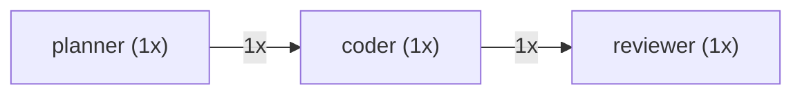

# OrchEval

[](https://pypi.org/project/orcheval/)
[](https://www.python.org/downloads/)
[](LICENSE)

Evaluate, profile, and debug multi-agent LLM systems.

## What OrchEval Analyzes

- Cost and token breakdown by node and model
- Routing decision audit with pattern detection (invariant routing, oscillation, dominant paths)
- Multi-pass convergence tracking with per-metric trend classification
- Retry and error pattern analysis with success rates
- LLM behavioral patterns (prompt growth, stuck agents, redundant tool calls)
- Execution timeline with span hierarchy and state diffs
- Cross-run aggregation with outlier detection and trend analysis

## Architecture

OrchEval has three layers:

```
Collect         →    Report          →    Inspect
─────────────        ──────────────       ──────────────
Adapters emit        report() runs        to_digest()
framework events     6 analysis modules   to_html()
into Traces          compare_runs()       to_mermaid()
                     TraceCollection      to_dataframe()
```

For contributor details, see the directory READMEs:
[`src/orcheval/`](src/orcheval/README.md) |
[`src/orcheval/adapters/`](src/orcheval/adapters/README.md) |
[`src/orcheval/report/`](src/orcheval/report/README.md) |
[`tests/`](tests/README.md)

## Installation

```bash
pip install orcheval                    # core (pydantic only)
pip install orcheval[langgraph]         # + LangGraph adapter
pip install orcheval[openai_agents]     # + OpenAI Agents SDK adapter
pip install orcheval[pandas]            # + DataFrame export
```

## Quickstart

```python
from orcheval import Tracer

tracer = Tracer(adapter="langgraph")
result = graph.invoke(input, config={"callbacks": [tracer.handler]})
trace = tracer.collect()

print(trace.node_sequence())   # ['planner', 'coder', 'reviewer']
print(trace.total_cost())      # 0.025
print(trace.total_tokens())    # {'prompt': 950, 'completion': 350, 'total': 1300}
```

```python
# Compact text digest — feed it to an LLM for analysis
print(trace.to_digest())
```

```
# Trace Digest: a1b2c3d4

## Overview
- **Nodes:** planner → coder → reviewer (3 unique)
- **Duration:** 5300ms
- **Cost:** $0.025 (950 prompt + 350 completion = 1300 tokens)
- **Errors:** 0

## Execution Flow
1. **planner** — 1 LLM call (gpt-4o), 1500ms
2. **coder** — 1 LLM call (gpt-4o), 1 tool call (execute_code), 3000ms
3. **reviewer** — 1 LLM call (gpt-4o-mini), 800ms
```

## Reports

```python
from orcheval import report

full = report(trace)

# Cost breakdown
full.cost.total_cost            # 0.025
full.cost.most_expensive_node   # 'coder'
full.cost.most_expensive_model  # 'gpt-4o'

# Routing audit
full.routing.total_decisions    # 2
full.routing.flags              # [RoutingFlag(flag_type='invariant_routing', ...)]

# Convergence (for multi-pass systems)
full.convergence.is_converging  # True
full.convergence.total_passes   # 3

# Timeline
full.timeline.total_duration_ms # 5300.0

# Retries and errors
full.retries.total_errors       # 0
full.retries.retry_sequences    # []

# LLM behavioral patterns
full.llm_patterns.patterns      # [LLMPattern(pattern_type='prompt_growth', ...)]
```

Individual reports can be generated separately:

```python
from orcheval.report import cost_report, routing_report

cost = cost_report(trace)
routing = routing_report(trace)
```

### Routing Flags

OrchEval detects suspicious routing patterns automatically:

```python
for flag in full.routing.flags:
    print(f"[{flag.flag_type}] {flag.description}")
# [invariant_routing] planner always routes to coder (3/3 decisions)
# [dominant_path] coder routes to reviewer 95%+ of the time
```

Flag types: `invariant_routing`, `context_divergence`, `dominant_path`, `oscillation`.

### LLM Patterns

```python
for p in full.llm_patterns.patterns:
    print(f"[{p.severity}] {p.pattern_type}: {p.description}")
# [warning] prompt_growth: coder input tokens grew 120% across invocations
# [warning] redundant_tool_call: execute_code called 3x with identical input
# [info] output_not_utilized: reviewer LLM output produced but state unchanged
```

Pattern types: `prompt_growth`, `repeated_output`, `redundant_tool_call`, `system_message_variance`, `output_not_utilized`.

## HTML Visualization

```python
trace.to_html("trace.html")  # writes to orcheval_outputs/trace.html
```

Generates a self-contained HTML file (no external dependencies) with:
- Summary metrics panel (duration, cost, tokens, errors)
- Interactive waterfall timeline with swimlane layout per node
- Click-to-expand detail panels showing LLM calls, tool calls, errors, and state diffs

All export methods that accept a bare filename (e.g. `"trace.html"`) write to the `orcheval_outputs/` directory by default. Paths with a directory component or absolute paths are used as-is.

Open `orcheval_outputs/trace.html` in any browser.


https://github.com/user-attachments/assets/9159c468-1993-4ed5-99b2-aa731db0476a


## Text Digest

```python
# Compact overview
print(trace.to_digest())

# Focus on specific nodes, collapse others into a summary line
print(trace.to_digest(focus_nodes=["coder"]))

# Include full LLM prompt/response content
print(trace.to_digest(include_llm_content=True))

# Control output size (~4 chars per token)
print(trace.to_digest(max_chars=8_000))

# Reuse a precomputed FullReport
print(trace.to_digest(reports=full))
```

## Run Comparison

```python
from orcheval import compare_runs

diff = compare_runs(baseline_trace, experiment_trace)

# Natural-language summary of all changes
print(diff.summary)
# "Cost increased $0.025 → $0.031 (+24.0%). coder duration flagged: 3000ms → 4200ms (+40.0%)."

# Programmatic access
diff.cost.total_delta.delta       # 0.006
diff.cost.total_delta.pct_change  # 24.0
diff.duration.total_delta.flagged # True
diff.errors.new_errors            # []
diff.llm_patterns.new_patterns    # [PatternDiff(...)]

# Or compare directly from a trace
diff = baseline_trace.compare(experiment_trace)
```

## Cross-Run Aggregation

```python
from orcheval import TraceCollection

collection = TraceCollection.from_traces(trace1, trace2, trace3, trace4, trace5)
# Or load from a directory of JSON files:
# collection = TraceCollection.from_json_dir("traces/")

# Aggregate statistics
summary = collection.summary()
summary.trace_count                # 5
summary.total_cost.mean            # 0.027
summary.total_cost.p95             # 0.035
summary.unique_node_names          # ['planner', 'coder', 'reviewer']

# Per-node breakdown
coder_stats = collection.node_stats("coder")
coder_stats.duration.median        # 3100.0
coder_stats.cost.mean              # 0.015
coder_stats.error_rate             # 0.2

# Outlier detection
outliers = collection.find_outliers("cost", threshold=2.0)
for o in outliers:
    print(f"Trace {o.trace_id}: {o.metric}={o.value:.3f} (median={o.median:.3f}) — {o.reason}")
# Trace abc123: cost=0.052 (median=0.027) — cost is 1.93x the median (threshold: 2.0x)

# Execution shape clustering
for shape in collection.execution_shapes():
    print(f"{shape.node_sequence} — {shape.trace_count} traces ({shape.fraction:.0%})")
# ['planner', 'coder', 'reviewer'] — 4 traces (80%)
# ['planner', 'coder', 'coder', 'reviewer'] — 1 trace (20%)

# Trend analysis
trend = collection.trend("cost")
trend.direction   # 'increasing'
trend.change_pct  # 15.2
```

## Mermaid Export

```python
print(trace.to_mermaid())
```



GitHub renders Mermaid blocks natively. Nodes with errors are highlighted in red.

## DataFrame Export

```python
df = trace.to_dataframe()  # requires pip install orcheval[pandas]
```

One row per event. Columns include: `event_type`, `timestamp`, `node_name`, `span_id`, `duration_ms`, `model`, `input_tokens`, `output_tokens`, `cost`, `tool_name`, `error_type`, `source_node`, `target_node`, and more.

## Framework Support

### LangGraph

```python
from orcheval import Tracer

tracer = Tracer(adapter="langgraph")
result = graph.invoke(input, config={"callbacks": [tracer.handler]})
trace = tracer.collect()
```

Options:

```python
# Infer routing decisions from node transitions
tracer = Tracer(adapter="langgraph", infer_routing=True)

# Capture input/output state on each node
tracer = Tracer(adapter="langgraph", capture_state=True)
```

### OpenAI Agents SDK

```python
from orcheval import Tracer
from agents.tracing import add_trace_processor

tracer = Tracer(adapter="openai_agents")
add_trace_processor(tracer.handler)

result = await Runner.run(agent, "Summarize the document")
trace = tracer.collect()
```

Options:

```python
# Infer routing decisions between agents
tracer = Tracer(adapter="openai_agents", infer_routing=True)

# Capture agent metadata (name, tools, handoffs, output_type)
tracer = Tracer(adapter="openai_agents", capture_state=True)
```

### Manual Adapter

For frameworks without a built-in adapter:

```python
from orcheval import Tracer

tracer = Tracer()  # defaults to manual
a = tracer.adapter

a.node_entry("agent")
a.llm_call(node_name="agent", model="gpt-4o", input_tokens=150, output_tokens=80, cost=0.005)
a.tool_call("search", node_name="agent", tool_input={"query": "test"}, tool_output="result")
a.node_exit("agent", duration_ms=3000.0)

trace = tracer.collect()
```

Same `Trace` object, same analysis, regardless of framework.

## Saving and Loading Traces

```python
# Serialize
json_str = trace.to_json()          # returns JSON string
trace.to_json("trace.json")         # also writes to orcheval_outputs/trace.json
d = trace.to_dict()

# Deserialize
from orcheval import Trace
loaded = Trace.from_json(json_str)          # from string
loaded = Trace.from_json_file("trace.json") # from file
loaded = Trace.from_dict(d)

# Merge multiple traces
combined = Trace.merge(trace1, trace2, trace3)
```

### Generate HTML from saved files

```python
from orcheval import html_from_files

# From trace file only (report auto-generated)
html_from_files("orcheval_outputs/trace.json", output_path="trace.html")

# From trace + pre-computed report
html_from_files("orcheval_outputs/trace.json", "report.json", output_path="trace.html")

# Or load individually
from orcheval import Trace, FullReport
trace = Trace.from_json_file("orcheval_outputs/trace.json")
report = FullReport.from_json_file("report.json")
trace.to_html("trace.html", reports=report)
```

## Known Limitations

- **LangGraph routing detection**: LangGraph does not provide explicit routing/conditional-edge
  callbacks. Pass `infer_routing=True` to `Tracer` to emit inferred `RoutingDecision` events
  based on node transition sequences. These carry `metadata={"inferred": True}` and may not
  reflect actual conditional logic. For precise routing data, use the manual adapter's
  `routing_decision()` method.

- **Pass boundaries / convergence tracking**: Neither the LangGraph adapter nor the OpenAI Agents
  adapter emits `PassBoundary` events automatically. `convergence_report()` will always return an
  empty report unless you record pass boundaries manually via `ManualAdapter.pass_boundary()`.
  This means convergence analysis requires explicit user instrumentation regardless of framework.

- **Cost data**: `LLMCall.cost` is a passthrough field — it is auto-populated when the LLM
  provider reports cost in the callback response. OrchEval does not include a built-in pricing
  table. When cost is unavailable, the cost report falls back to token counts and call counts.

## License

Apache 2.0
